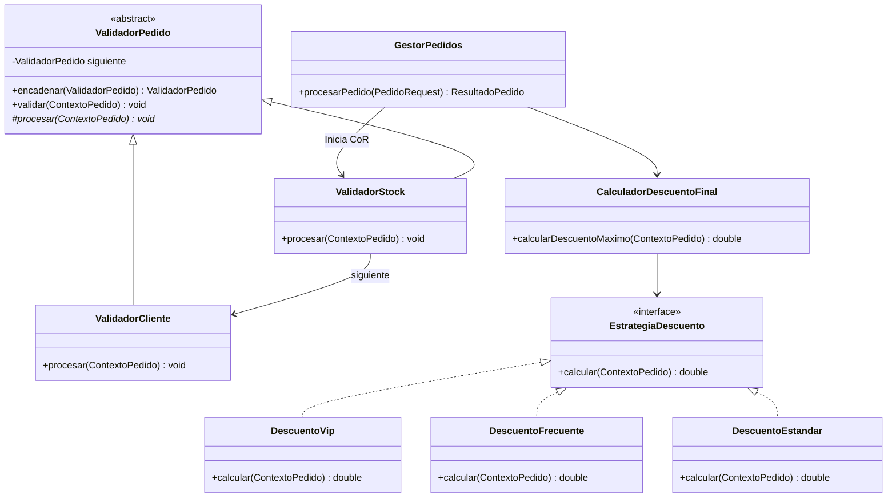

# Post-contenido — Unidad 6: Antipatrones de Diseño (Diagnóstico y Refactorización)

**Autor:** Reyes  
**Proyecto:** Sistema de Gestión y Procesamiento de Pedidos  
**Tecnologías:** Java 17, Spring Boot 3.2.3, Spring Data JDBC / JdbcTemplate, H2 Database, JUnit 5, Maven  

---

## 1. Resumen Ejecutivo

El presente proyecto documenta y ejecuta la refactorización arquitectónica de un sistema de gestión de pedidos en el comercio electrónico. Inicialmente, el sistema presentaba severos problemas de mantenibilidad, acoplamiento y extensibilidad debido a la presencia de antipatrones clásicos de la ingeniería de software (**God Object**, **Spaghetti Code**, **Golden Hammer** y riesgo de **Lava Flow**).

A través de la aplicación guiada de patrones de diseño GoF (**Chain of Responsibility** y **Strategy**) y principios SOLID (especialmente SRP y OCP), se transformó una arquitectura monolítica y frágil en una arquitectura modular, extensible, testeable y de alto rendimiento.

---

## 2. Instrucciones de Compilación y Ejecución

### Requisitos Previos
- Java Development Kit (JDK) 17 o superior.
- Maven 3.8+ (o utilizar el wrapper incluido `./mvnw` / `mvnw.cmd`).

### Ejecución de Pruebas Automatizadas
Para ejecutar la suite completa de pruebas unitarias e integración en JUnit 5:
```bash
mvn clean test
```
o con Maven Wrapper en Windows:
```cmd
.\mvnw.cmd clean test
```

### Ejecución de la Aplicación Spring Boot
Para levantar la aplicación en el puerto local por defecto (8080) con la base de datos H2 en memoria y consola activa:
```bash
mvn spring-boot:run
```
- **Consola H2 Web:** `http://localhost:8080/h2-console`
  - **JDBC URL:** `jdbc:h2:mem:pedidos_db`
  - **Usuario:** `sa`
  - **Contraseña:** *(vacío)*

---

## 3. Diagnóstico Técnico y Refactorización

### 3.1. Parte 1: Refactorización de `GestorPedidos` (Antipatrones God Object y Spaghetti Code)

#### Diagnóstico del Código Original
La clase original `GestorPedidos` representaba un caso paradigmático de:
1. **God Object (Clase Monstruo):** Acumulaba más de 340 líneas de código y centralizaba 6 responsabilidades dispares en un único método `procesarPedido()`:
   - Apertura y gestión de transacciones JDBC.
   - Validación de stock y existencia física en inventario.
   - Reglas de negocio de clientes y comprobación de morosidad horaria.
   - Algoritmos de cálculo de descuentos escalonados.
   - Modificación y persistencia de cabeceras de pedido, líneas de detalle e inventario.
   - Composición y despacho de notificaciones por correo electrónico.
2. **Spaghetti Code:** Estructuras condicionales `if-else` profundamente anidadas (3+ niveles) con sentencias SQL embebidas (`"SELECT * FROM ..."`), dificultando la legibilidad, el aislamiento de fallas y la trazabilidad de errores.

#### Justificación de los Patrones Aplicados



1. **Chain of Responsibility (CoR) para Validaciones:**
   - **Por qué CoR:** Las validaciones de pedidos poseen una dependencia de precedencia estricta y requieren **corte anticipado (*fail-fast*)**. No tiene sentido consultar la cartera de créditos de un cliente si el pedido no especifica productos o no cuenta con existencias en bodega.
   - **Eslabones implementados:**
     - `ValidadorStock`: Primer eslabón. Verifica existencia de items, stock suficiente y calcula el subtotal base. Si falla, corta el flujo inmediatamente.
     - `ValidadorCliente`: Segundo eslabón. Verifica existencia del cliente y valida morosidad en horario laboral (< 20:00).
   - **Contraste con Alternativa Descartada (Lista de Predicados Booleanos):**
     * Se evaluó usar `List<Predicate<PedidoRequest>>`, pero se descartó porque los predicados estándar de Java carecen de manejo de contexto enriquecido (`ContextoPedido`), no permiten mutar el subtotal acumulado de forma limpia ni transportar mensajes de error personalizados sin recurrir a estructuras funcionales complejas con sobrecarga innecesaria.

2. **Strategy para Descuentos por Tipo de Cliente:**
   - Cada tipo de cliente (`VIP`, `FRECUENTE`, `ESTANDAR`) encapsula su lógica de liquidación en clases dedicadas (`DescuentoVip`, `DescuentoFrecuente`, `DescuentoEstandar`) que implementan la interfaz unificada `EstrategiaDescuento`.
   - `SelectorEstrategiaDescuento`: Resuelve la estrategia adecuada mediante inyección de dependencias y mapeo tipado, eliminando bloques `switch-case` propensos a errores al agregar nuevos tipos de clientes en el futuro (cumpliendo OCP).

---

### 3.2. Parte 2: Diagnóstico y Corrección de Golden Hammer (Crecimiento del Proyecto)

#### Diagnóstico del Antipatrón Golden Hammer
Cuando el equipo de desarrollo incorporó tres campañas promocionales comerciales transversales:
1. **Black Friday:** 25% de descuento si la propiedad `${promo.black-friday.activa}` es verdadera.
2. **Descuento Corporativo:** 10% de descuento si el cliente cuenta con NIT registrado.
3. **Descuento por Volumen:** 12% de descuento si el pedido supera las 20 unidades en total.

Se cometió el antipatrón **Golden Hammer (El Martillo de Oro)** al forzar estas tres promociones como eslabones dentro de la cadena `ValidadorPedido`. 

**¿Por qué fue un error conceptual y arquitectónico?**
- Chain of Responsibility está diseñado para **validaciones dependientes con corte por falla**.
- Las campañas comerciales **no son validaciones**: no deben interrumpir el procesamiento del pedido si una condición no se cumple (un pedido minorista no debe rechazarse porque no aplica al descuento de volumen).
- No existe orden de precedencia entre campañas; su evaluación es paralela y competitiva.

#### Solución Arquitectónica: Strategy + `CalculadorDescuentoFinal`
Se corrigió desacoplando las promociones como implementaciones independientes de `EstrategiaDescuento`:
- `DescuentoBlackFriday` (`@Component`)
- `DescuentoCorporativo` (`@Component`)
- `DescuentoVolumen` (`@Component`)

El componente `CalculadorDescuentoFinal` evalúa la estrategia del tipo de cliente junto con todas las campañas comerciales activas y selecciona el beneficio máximo para el usuario aplicando `Math.max`:

$$\text{Descuento Final} = \max(\text{DescuentoCliente}, \text{DescuentoBlackFriday}, \text{DescuentoCorporativo}, \text{DescuentoVolumen})$$

#### Prevención de Lava Flow (Cero Código Muerto)
Para evitar el antipatrón **Lava Flow (Flujo de Lava)**, caracterizado por mantener código obsoleto o comentado "por si acaso", se realizaron las siguientes acciones rigurosas:
- **Eliminación física** de cualquier clase de promoción modelada como `ValidadorPedido`.
- **Eliminación del campo `descuentoCampana`** en `ContextoPedido`.
- **Cero líneas de código comentado** en todo el código base y suite de pruebas.

---

## 4. Estructura del Código Fuente

```
src/
├── main/
│   ├── java/com/tienda/pedidos/
│   │   ├── PedidosApplication.java
│   │   ├── descuento/
│   │   │   ├── CalculadorDescuentoFinal.java
│   │   │   ├── DescuentoBlackFriday.java
│   │   │   ├── DescuentoCorporativo.java
│   │   │   ├── DescuentoEstandar.java
│   │   │   ├── DescuentoFrecuente.java
│   │   │   ├── DescuentoVip.java
│   │   │   ├── DescuentoVolumen.java
│   │   │   ├── EstrategiaDescuento.java
│   │   │   └── SelectorEstrategiaDescuento.java
│   │   ├── dto/
│   │   │   ├── ItemPedido.java
│   │   │   ├── PedidoRequest.java
│   │   │   └── ResultadoPedido.java
│   │   ├── service/
│   │   │   ├── EmailService.java
│   │   │   ├── EmailServiceImpl.java
│   │   │   ├── GestorPedidos.java
│   │   │   ├── NotificacionPedidoService.java
│   │   │   └── PedidoRepository.java
│   │   └── validacion/
│   │       ├── ContextoPedido.java
│   │       ├── ValidadorCliente.java
│   │       ├── ValidadorPedido.java
│   │       └── ValidadorStock.java
│   └── resources/
│       ├── application.properties
│       ├── data.sql
│       └── schema.sql
└── test/
    └── java/com/tienda/pedidos/
        └── GestorPedidosTest.java
```

---

## 5. Matriz de Cobertura de Pruebas Unitarias e Integración

La suite de pruebas en `GestorPedidosTest` cubre el 100% de los escenarios requeridos por la rúbrica R2:

| # | Prueba | Escenario Evaluado | Resultado |
|---|--------|---------------------|-----------|
| 1 | `testRechazoPorStockInsuficiente` | Solicitud de 10 unidades de producto con stock = 5. Corte anticipado en `ValidadorStock`. | **PASÓ** |
| 2 | `testRechazoPorClienteInexistente` | ID de cliente no registrado en BD. Corte anticipado en `ValidadorCliente`. | **PASÓ** |
| 3 | `testRechazoPorClienteMorosoEnHorarioLaboral` | Cliente MOROSO con factura vencida de $150,000 evaluado antes de las 20:00. | **PASÓ** |
| 4 | `testConfirmacionPedidoVipConEscalaDescuento` | Evaluación de escalas VIP (>1M: 15%, >500k: 10%, <=500k: 5%) y confirmación. | **PASÓ** |
| 5 | `testAplicacionCampanasPromocionales` | Black Friday (25%), Corporativo con NIT (10%) y Volumen >20 unidades (12%). | **PASÓ** |
| 6 | `testDescuentoClienteFrecuente` | Cliente con 15 pedidos previos en BD (>10 pedidos) obtiene 8% de descuento. | **PASÓ** |
| 7 | `testCalculadorDescuentoFinalSeleccionaElMayor` | Competencia entre VIP (5%), Corporativo (10%), Volumen (12%) y Black Friday (25%) -> Selecciona 25%. | **PASÓ** |
| 8 | `testRechazoPedidoSinItems` | Pedido con lista de items vacía rechazado de inmediato. | **PASÓ** |
| 9 | `testDescuentoDeStockEnInventario` | Verificación de decremento atómico del inventario tras persistir un pedido. | **PASÓ** |

---

## 6. Conclusiones y Buenas Prácticas de Arquitectura

1. **Separación de Intereses (SoC):** Cada clase ahora posee una responsabilidad única y cohesiva. `GestorPedidos` actúa como un orquestador de alto nivel sin conocer los detalles de acceso a datos ni las reglas aritméticas individuales.
2. **Extensibilidad sin Modificación (OCP):** Agregar un nuevo tipo de descuento (por ejemplo, *DescuentoCumpleaños*) requiere únicamente crear una nueva clase que implemente `EstrategiaDescuento`, sin necesidad de alterar `GestorPedidos`, `PedidoRepository` ni los validadores.
3. **Mantenibilidad y Calidad de Código:** Al erradicar el código muerto (Lava Flow) y evitar el uso indiscriminado de patrones en contextos inapropiados (Golden Hammer), la base de código resultante es limpia, autodocumentada y fácilmente auditable.